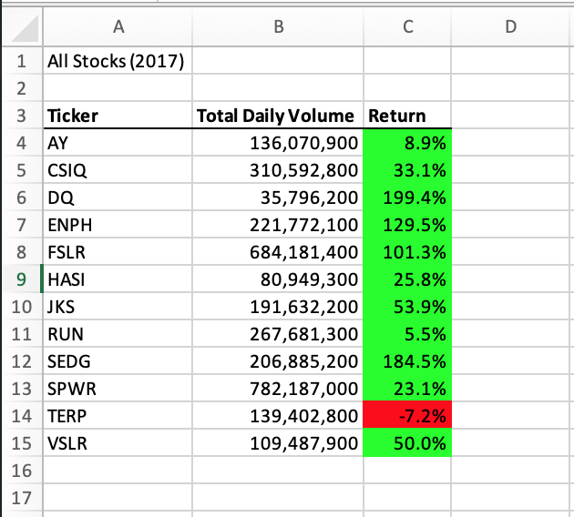

# 2017-18 Stock Analysis

## 1. Project Overview

This analysis used VBA to calculate percentage returns and total trading volume for 12 different energy stocks over the years 2017 and 2018.
The code can be run and the results viewed in 
The specific code for this work refactored a previous analysis to compare runtimes between the original and refactored subroutines.
The results of interest here are thus the yearly stock performances and the runtime of the code itself. 

## 2. Results

### Stock Performance

I calculated stock trading volume and annual percentage return in both 2017 and 2018.
Returns in 2017 were positive for all stocks except for TerraForm Power (TERP) and were generally high (average return across all 12 stocks = 67.3%).
The average trading volume for the year was 263.9 million shares per company (total = 3.2 billion, standard deviation = 223.4 million)



Returns in 2018 were generally poor. While Enphase Energy (ENPH) and Sunrun, Inc (RUN) showed substantial positive returns (mean = 82.95), the remaining stocks all lost value in 2018 (mean = -26.8%).
  
The average trading volume in 2018 was 275.5 million (total = 3.3 billion, standard deviation = 187.5 million)


Across all stocks, trading volumes were generally comparable between years. 
Returns improved from 2017 to 2018 for all stocks except ENPH, which did continue to appreciate in 2018, albeit at a lower rate. 


### Analysis Runtimes

The refactored analysis presented here is substantially faster than the original analysis.
On my computer, refactored analyses on both years ran for ~0.12 seconds:


This runtime compares to ~0.75s for the original code:


My guess is that this increased efficiency is likely due to the use of an iterative ticker index and arrays to hold data for each stock.
The original code used nested For loops to search through rows of data and ticker IDs:
````
    'outer loop through tickers
    For i = 0 To 11
    
        ticker = tickers(i)
        totalVolume = 0
        
        Sheets(yearValue).Activate
        
        'inner loop through rows of data
        For j = 2 To RowCount

		...
	
		Next j
	
	Next i
````
The refactored code abandons the outer loop and uses arrays to store data for each stock in a known location:

````
    '1a) Create a ticker Index
    tickerIndex = 0

    '1b) Create three output arrays
    Dim tickerVolumes(12) As Long
    Dim tickerStartingPrices(12) As Single
    Dim tickerEndingPrices(12) As Single
    
    ''2a) Create a for loop to initialize the tickerVolumes to zero.
    For i = 0 To 11
        
        tickerVolumes(i) = 0
    
    Next i
        
    ''2b) Loop over all the rows in the spreadsheet.
    For r = 2 To RowCount
    
    ...
    
    Next r

````
I would guess that this approach reduces the amount of searching time required in the new analysis, decreasing the overall runtime considerably: 
the refactored runtimes represent an approximately 84% reduction in runtime from the original code.


## 3. Summary

### What are the advantages or disadvantages of refactoring code?
This analysis demonstrates one of the clear advantages of refactoring code: increasing code efficiency can reduce runtimes for analyses.
Though a difference of 0.12 vs 0.75 seconds doesn't feel like much for this particular analysis, an equivalent 84% reduction in runtime could make a huge difference for more substantial analyses on large datasets that need minutes, hours, or days to complete.
One disadvantage of refactoring is the time required to do the actual refactoring. If a given analysis already runs quickly, or won't be needed to run again in the future, then the time required for an effective refactoring might not be as valuable as time spent elsewhere.

### How do these pros and cons apply to refactoring the original VBA script?
Because this analysis already ran so quickly in its original form, a quicker, a refactored analysis doesn't represent a particularly meaningful amount of time saved.
The pros and cons of either analysis here come mostly from the act of coding them and learning how to apply them. 
For example, much of the original analysis falls within two nested For loops, whereas the refactored analysis requires more loops run successively. 
Using either nested For loops or iterating through arrays represent two alternative tools with different strengths and weaknesses. Having seen them in practice will help inform when one or the other is a better fit for a given later analysis.

